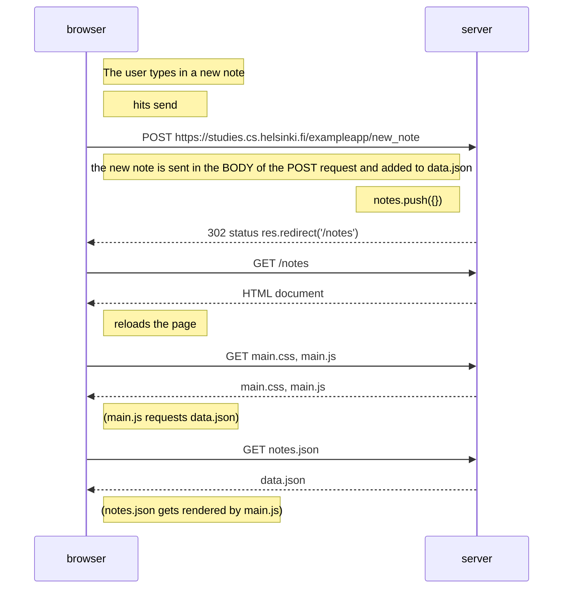

```mermaid
sequenceDiagram
participant browser
participant server

Note right of browser: The user types in a new note
Note right of browser: hits send
browser ->> server: POST https://studies.cs.helsinki.fi/exampleapp/new_note
Note left of server: the new note is sent in the BODY of the POST request and added to data.json
Note left of server: notes.push({})

server -->> browser:  302 status res.redirect('/notes')

browser ->> server: GET /notes
server -->> browser: HTML document
Note right of browser: reloads the page

browser ->> server: GET main.css, main.js
server -->> browser: main.css, main.js
Note right of browser: (main.js requests data.json)


browser ->> server: GET notes.json
server -->> browser: data.json

Note right of browser: (notes.json gets rendered by main.js)

```