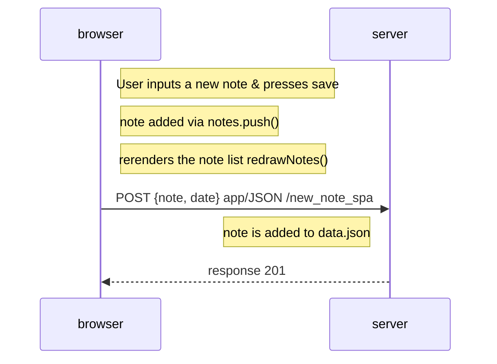

```mermaid
sequenceDiagram
participant browser
participant server

Note right of browser: User inputs a new note & presses save
Note right of browser: note added via notes.push()
Note right of browser: rerenders the note list redrawNotes()


browser ->> server: POST {note, date} app/JSON /new_note_spa 
Note left of server: note is added to data.json
server -->>browser: response 201

```